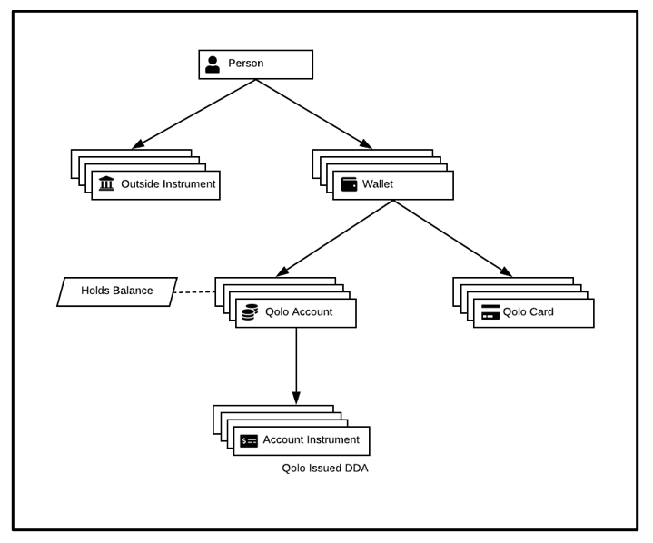

# Qolo Platform Structure

The diagram below summarizes the Qolo platform structure and the relation between its various components.

<!--  -->

The Qolo platform structure allows for flexible implementation of your unique program.

## Qolo Platform Components

**Person:** A person on the Qolo Platform can be an individual or a company. Qolo platform sets up all end users, cardholders, clients, program partners and any third-party service providers as a &#39;Person&#39; on the platform. [API reference](https://devdocs.qolopay.com/openapi/qoloreference/tag/Persons)

**Outside Instrument:** Outside Instruments are used to identify external bank account or debit/credit cards. Registered Persons on Qolo platform can move funds in either direction between their Qolo account and registered Outside Instruments, based on their program configuration. [API reference](https://devdocs.qolopay.com/openapi/qoloreference/operation/CreateInstrument)

**Wallet:** A wallet, assigned to a person, holds various Qolo accounts and cards corresponding to the person. A person may have one or multiple wallets on the platform. [API reference](https://devdocs.qolopay.com/openapi/qoloreference/operation/CreateWallet)

**Qolo Account:** An account is a currency account issued and maintained at Qolo. Accounts are encapsulated in a person&#39;s wallet. [API reference](https://devdocs.qolopay.com/openapi/qoloreference/operation/CreateAccount)

**Qolo Issued DDA:** A Qolo Account may have one or multiple DDAs associated with it. Users can add funds to their Qolo Accounts by sending funds to these associated DDAs.

**Qolo Card:** A card is a payment device that enables a user to conduct transactions at merchants, either online or offline. Qolo Cards are assigned to a person&#39;s wallet and access funds from Qolo Accounts in the same wallet. [API reference](https://devdocs.qolopay.com/openapi/qoloreference/operation/CreateCard)