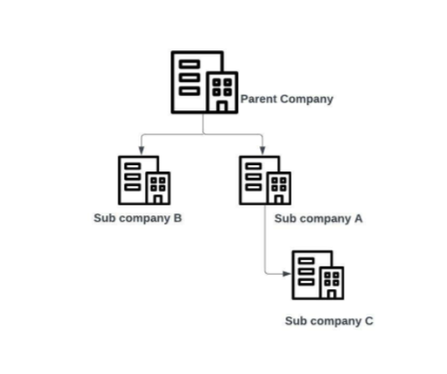

# Company

A Program is associated with a company. The Qolo program and company hierarchy allows clients to create unlimited levels of company and program hiearchy. [API reference](https://devapi.qolopay.com/index.html#operation/CreateCompany)

This concept of hierarchy allows clients to setup multiple programs with different use cases, but still grouped under a master program.

