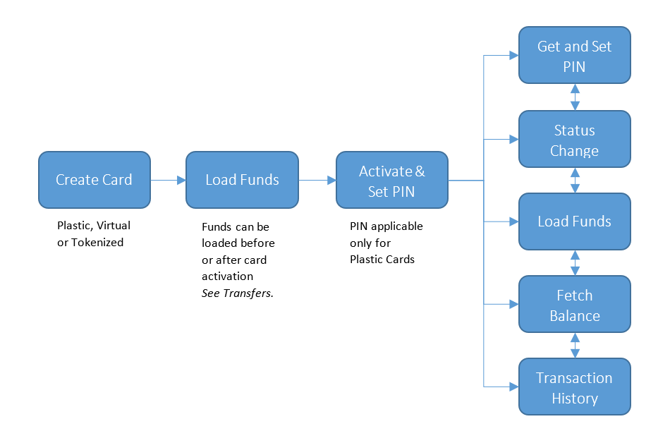

# Card

A card is a payment device attached to a Person Account on Qolo platform. It accesses the funds in the Account and enables the Person to transact at merchants or withdraw funds from an ATM. Cards can be physical or virtual and may be tokenized for use in digital wallets like Apple Pay or Samsung Pay.

Card parameters are defined under a Qolo Program and includes –

1. _Card Form -_ Physical, Virtual, Tokenized
2. _Card Issuance Type -_ Single Issuance, Bulk Issuance, Instant Issue
3. _Card Scheme -_ Visa, MasterCard, Discover
4. _Card BIN / Sub BIN_
5. _Card Currencies_
6. _Single Load or Reloadable_

Card on Qolo platform are represented by 'card' object and comprises of all the card information.

A typical Card lifecycle in a card based Program may be depicted as:

